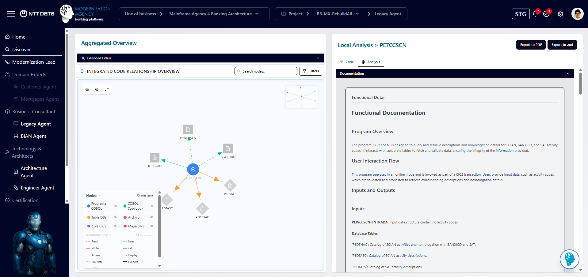
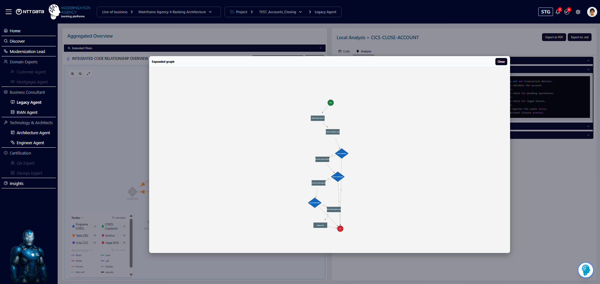
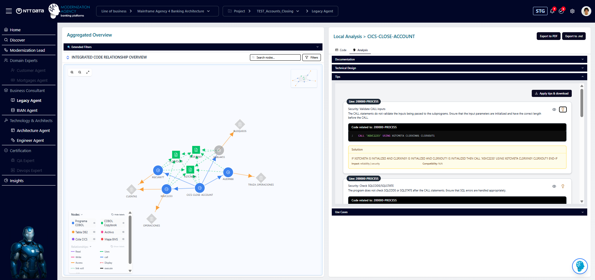
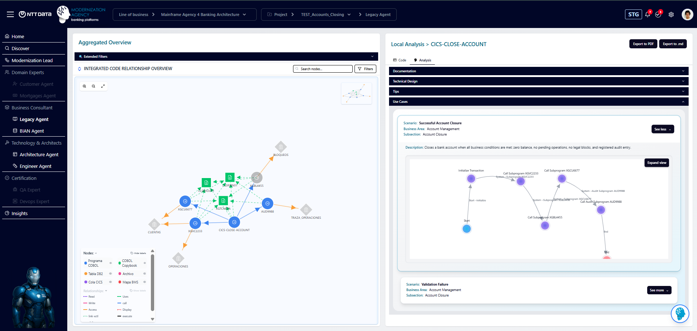
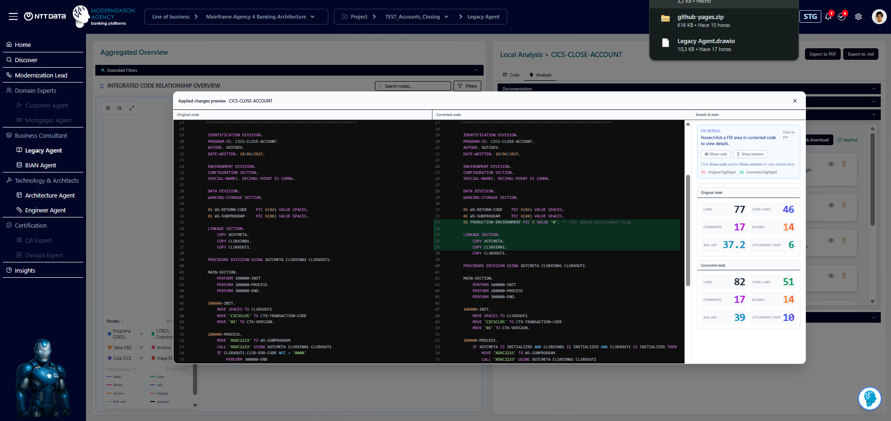

# LEGACY AGENT — CODING

## 1. Propósito del flujo
| Objetivo |
|----------|
| Analizar código COBOL/JCL para generar documentación funcional, técnica, tips, casos de uso, pseudocódigo, diagramas y código autofix. |

---

## 2. Entradas del proceso
| Variable | Descripción |
|----------|-------------|
| `input` | Código COBOL/JCL a procesar |
| `client` | Identificador del cliente |

---

## 3. Fases del flujo

### 3.1 Generación con IA
| Artefacto | Workflow | Template (Prompt) |
|-----------|----------|--------|
| Documentación legacy | `call-ai-v-2:1.0.3` | `legacy-agent-documentation-prompt-v-2:1.0.5` |
| Tips | `call-ai-v-2:1.0.3` | `legacy-agent-tips-prompt-v-2-1:1.0.0` |
| Use Cases | `call-ai-v-2:1.0.3` | `legacy-use-cases-definition:1.0.1` |

Documentación legacy en la Agencia

Tips en la Agencia

Uses Cases en la Agencia

---

### 3.2 Postproceso
| Snippet | Función |
|---------|---------|
| `snippet-postprocess-legacy-ia:1.0.1` | Limpieza, normalización y extracción de variables clave del output IA |

---

### 3.3 Autofix
| Acción | Workflow |
|--------|----------|
| Aplicación automática de tips al código fuente | `legacy-autofixcode-2-1:1.0.0` |

Autofix en la Agencia

---

### 3.4 Persistencia
| Artefacto | Dataset |
|-----------|---------------------|
| Documentación funcional | `legacy-functional-documentation-v-2:1.0.0` |
| Documentación técnica | `legacy-technical-documentation-v-2:1.0.0` |
| Tips | `legacy-documentation-tips-v-2:1.0.0` |
| Diagrama técnico | `legacy-documentation-technical-diagram:1.0.0` |
| Autofix code | `ds-legacy-autofixcode-2-1:1.0.0` |
| Use Cases | `legacy-use-cases-dataset:1.0.0` |

---

### 3.5 Limpieza
| Acción | Nodo |
|--------|----------|
| Eliminación de variables residuales | `MapValues` |

---

## 4. Flujo lógico (resumen)
| Paso | Descripción |
|------|-------------|
| 1 | Generar documentación, tips y Use Cases |
| 2 | Realizar postprocesado IA |
| 3 | Generar código Autofix |
| 4 | Persistir artefactos en datasets |
| 5 | Limpiar variables |
| 6 | Emitir JSON consolidado |

---

## 5. Salida del flujo
El flujo produce y normaliza las siguientes variables, que constituyen el output final:

| Variable | Descripción |
|----------|-------------|
| `program_name` | Nombre del programa COBOL/JCL procesado |
| `functional_info` | Documentación funcional generada |
| `functional_name` | Nombre asignado al artefacto funcional |
| `technical_info` | Documentación técnica generada |
| `technical_name` | Nombre asignado al artefacto técnico |
| `entity_catalog` | Entidades, relaciones y mappings detectados |
| `entity_name` | Nombre del catálogo de entidades |
| `TechnicalDiagramDocumentation` | Contenido textual del diagrama técnico |
| `TechnicalDiagramName` | Nombre del diagrama técnico |
| `EntityTips` | Lista de tips generados |
| `EntityTipsName` | Nombre del artefacto de tips |
| `PseudocodeDocumentation` | Pseudocódigo generado por la IA |
| `PseudocodeName` | Nombre del artefacto de pseudocódigo |
| `functionalDetail` | Detalle funcional (nivel extendido) |
| `technicalDetail` | Detalle técnico (nivel extendido) |
| `mermaidDiagram` | Diagrama Mermaid asociado (si aplica) |
| `UseCases_legacy` | Casos de uso generados |
| `code_autofix` | Código autofijado producido por Autofix |