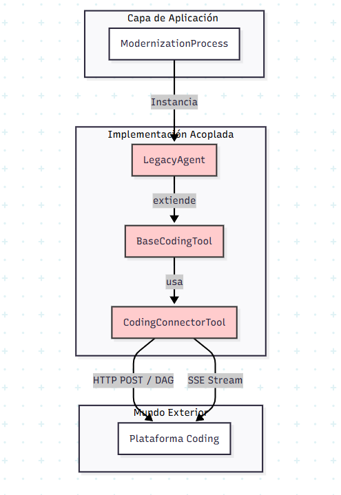
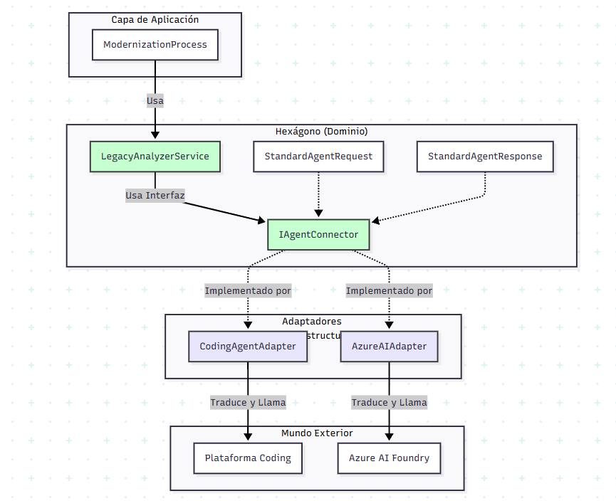

# Propuesta Técnica: Refactorización a Arquitectura Hexagonal en MABA

**Fecha:** 26 de Noviembre, 2025
**Asunto:** Desacoplamiento del backend y estandarización de proveedores de IA.

## 1. Contexto y Objetivo

El backend actual de MABA presenta un acoplamiento fuerte con la plataforma SaaS "Coding", lo que limita la capacidad de integrar nuevos proveedores de IA o ejecutar agentes de forma independiente.

Esta propuesta define la estrategia para migrar hacia una **Arquitectura Hexagonal (Puertos y Adaptadores)**, integrando un modelo de estandarización de parámetros ("Nuevo Enfoque") para abstraer las dependencias externas.

---

## 2. Análisis de la Arquitectura Actual

La implementación actual utiliza herencia de clases para conectar la lógica de negocio con la infraestructura, lo que genera rigidez.

### Limitaciones
1.  **Herencia vs Composición:** `LegacyAgent` extiende `BaseCodingTool`, fusionando la definición del agente con la herramienta de conexión.
2.  **Protocolo Hardcodeado:** La lógica de comunicación (POST -> JobID -> Stream) está implícita en las clases base.
3.  **Dependencia de Vocabulario:** Los nombres de variables internos (`input`, `inputFunc`) están atados a la API de Coding.

*(Ver diagrama As-Is en documentación adjunta)*



---

## 3. Arquitectura Propuesta

Se plantea un diseño basado en capas concéntricas donde el Dominio define las reglas y la Infraestructura se adapta.

### Componentes
1.  **Dominio:** Define interfaces (`StandardAgentRequest`) y servicios (`LegacyAnalyzerService`). No tiene dependencias externas.
2.  **Puertos:** Interfaz `IAgentConnector` que establece el contrato para solicitar servicios de IA.
3.  **Adaptadores:** `CodingAgentAdapter` implementa el puerto y actúa como traductor entre el dominio y la API externa.

*(Ver diagrama To-Be en documentación adjunta)*



---

## 4. Estandarización de Parámetros

Para evitar la contaminación del dominio con terminología externa, se define un contrato único de datos.

### Mapeo de Solicitudes (Request)

El adaptador transformará los datos del dominio al formato requerido por el proveedor:

| Concepto | Parámetro Dominio | Parámetro Coding (Legacy) | Parámetro Coding (BIAN) |
| :--- | :--- | :--- | :--- |
| **Tipo Agente** | `TYPE_AGENT` | (Implícito) | (Implícito) |
| **Cliente** | `CLIENT` | `client` | `client` |
| **Código Fuente** | `LEGACY_SOURCE` | `input` | - |
| **Doc. Funcional** | `FUNCTIONAL` | - | `inputFunc` |
| **Doc. Técnica** | `TECHNICAL` | - | `inputTech` |

### Mapeo de Respuestas (Response)

| Concepto | Parámetro Dominio | Parámetro Coding (Legacy) | Parámetro Coding (BIAN) |
| :--- | :--- | :--- | :--- |
| **Doc. Funcional** | `DOC_FUNCTIONAL` | `functionalDetail` | - |
| **Doc. Técnica** | `DOC_TECHNICAL` | `technicalDetail` | - |
| **Doc. BIAN** | `DOC_BIAN` | - | `BIANDocumentation` |
| **Diagramas** | `DIAGRAMS_TEXT` | `TechnicalDiagramDocumentation` | `MermaidDiagram` |

---

## 5. Ventajas de la Refactorización

1.  **Independencia:** Facilita el cambio o adición de proveedores (ej. Azure AI Foundry) mediante nuevos adaptadores.
2.  **Testabilidad:** Permite el uso de Mocks para probar la lógica de negocio sin depender de servicios externos.
3.  **Semántica:** El código utiliza terminología de negocio (`LEGACY_SOURCE`) en lugar de técnica.

## 6. Compatibilidad con Frontend (Anti-Corruption Layer)

Para mantener la compatibilidad con el Frontend actual durante la migración, se implementará una capa de traducción en la persistencia.

**Estrategia:**
El `persistenceManager.ts` actuará como ACL (Anti-Corruption Layer). Antes de guardar los datos, convertirá el formato estandarizado (`StandardAgentResponse`) al formato legacy esperado por el Frontend y la BD.

```typescript
// Concepto en persistenceManager.ts
function mapToLegacyFormat(standard: StandardAgentResponse): LegacyOutput {
    return {
        functionalDetail: standard.DOC_FUNCTIONAL,
        // ... mapeo inverso
    };
}
```

## 7. Plan de Implementación

1.  **Núcleo:** Definición de tipos y puertos (`IAgentConnector`).
2.  **Adaptador:** Implementación de `CodingAgentAdapter` (Traducción + Streams).
3.  **Servicios:** Refactorización progresiva de agentes (`LegacyAnalyzerService`) e inyección en el orquestador.

---

## 8. Stack y Estrategia de Migración

### 8.1 Stack Tecnológico
Se confirma el uso de **TypeScript/Node.js**.
*   **Motivo:** Idoneidad para orquestación asíncrona (I/O bound), manejo nativo de JSON y coherencia con el stack actual.

### 8.2 Estrategia: Strangler Fig
Se opta por una refactorización progresiva en lugar de una reescritura total.
*   **Enfoque:** Construir la nueva estructura en paralelo y migrar flujo a flujo (Legacy -> BIAN -> etc.), eliminando código antiguo tras la validación de cada paso.

---

## 9. Consideraciones Transversales

*   **Manejo de Errores:** Uso de *Exception Wrapping* en adaptadores para aislar al dominio de errores HTTP/Infraestructura.
*   **Observabilidad:** Implementación de *Correlation IDs* para trazabilidad end-to-end.
*   **Testing:** Enfoque en pruebas unitarias de dominio y pruebas de integración aisladas para adaptadores.

