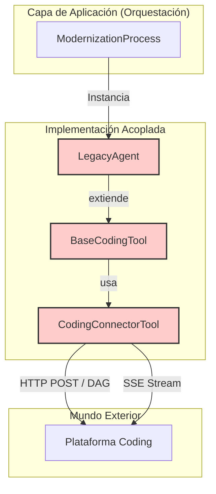
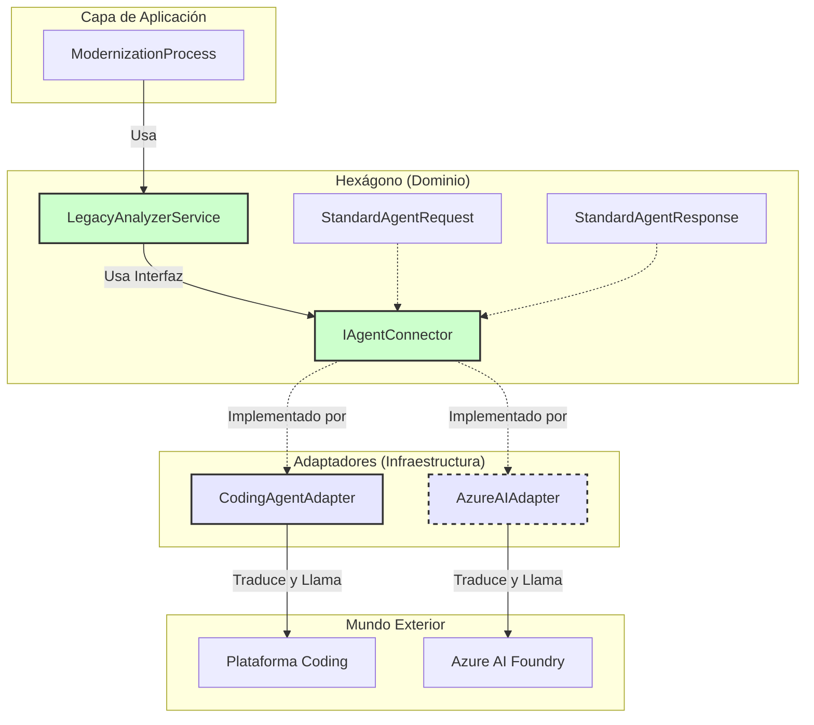

# Análisis de Refactorización a Arquitectura Hexagonal y Estandarización MABA

**Fecha:** 26 de Noviembre, 2025
**Estado:** Propuesta Técnica

## 1. Resumen Ejecutivo

Este documento detalla el análisis técnico y la estrategia para desacoplar el backend de la aplicación MABA de la plataforma SaaS "Coding". El objetivo es transicionar de una arquitectura fuertemente acoplada y basada en herencia a una **Arquitectura Hexagonal (Puertos y Adaptadores)**.

Esta refactorización integra el **"Nuevo Enfoque"** de estandarización de parámetros, estableciendo un Lenguaje Ubicuo en el Dominio que abstrae las particularidades de los proveedores externos (Coding, Azure AI Foundry, etc.).

---

## 2. Arquitectura Actual (As-Is): Acoplamiento Fuerte

Actualmente, la lógica de negocio (Agentes) y la infraestructura de comunicación están fusionadas mediante herencia de clases.

### Problemas Identificados
1.  **Herencia Rígida:** `LegacyAgent` extiende `BaseCodingTool`. Un agente *es* una herramienta de Coding, impidiendo su uso con otros proveedores.
2.  **Dependencia de Protocolo:** El sistema asume un flujo asíncrono específico (POST -> JobID -> Stream) hardcodeado en `CodingConnectorTool`.
3.  **Vocabulario Externo:** Los nombres de variables (`input`, `inputFunc`) están dictados por la API externa, contaminando el código interno.

### Diagrama As-Is



---

## 3. Arquitectura Propuesta (To-Be): Hexagonal + Estandarización

La nueva arquitectura separa las responsabilidades en capas concéntricas, donde el Dominio define las reglas y la Infraestructura se adapta a ellas.

### Componentes Clave
1.  **Dominio (Núcleo):** Define las interfaces de solicitud/respuesta estandarizadas (`StandardAgentRequest`) y los servicios de lógica de negocio (`LegacyAnalyzerService`).
2.  **Puertos (Frontera):** La interfaz `IAgentConnector` define el contrato para solicitar servicios de IA.
3.  **Adaptadores (Infraestructura):** `CodingAgentAdapter` implementa el puerto y actúa como **Traductor**, convirtiendo el lenguaje del dominio al lenguaje de la API externa.

### Diagrama To-Be



---

## 4. Estrategia de Estandarización (El "Nuevo Enfoque")

El Dominio no debe conocer los nombres de parámetros de Coding (`inputFunc`, `technicalDetail`). Se define un **Contrato Único** basado en el análisis funcional.

### Mapeo de Solicitudes (Request)

El `CodingAgentAdapter` será responsable de transformar estos campos:

| Concepto | Parámetro Dominio (Estandarizado) | Parámetro Coding (Legacy) | Parámetro Coding (BIAN) |
| :--- | :--- | :--- | :--- |
| **Tipo Agente** | `TYPE_AGENT` | (Implícito en URL) | (Implícito en URL) |
| **Cliente** | `CLIENT` | `client` | `client` |
| **Código Fuente** | `LEGACY_SOURCE` | `input` | - |
| **Doc. Funcional** | `FUNCTIONAL` | - | `inputFunc` |
| **Doc. Técnica** | `TECHNICAL` | - | `inputTech` |

### Mapeo de Respuestas (Response)

| Concepto | Parámetro Dominio (Estandarizado) | Parámetro Coding (Legacy) | Parámetro Coding (BIAN) |
| :--- | :--- | :--- | :--- |
| **Doc. Funcional** | `DOC_FUNCTIONAL` | `functionalDetail` | - |
| **Doc. Técnica** | `DOC_TECHNICAL` | `technicalDetail` | - |
| **Doc. BIAN** | `DOC_BIAN` | - | `BIANDocumentation` |
| **Diagramas** | `DIAGRAMS_TEXT` | `TechnicalDiagramDocumentation` | `MermaidDiagram` |

---

## 5. Beneficios del Cambio

1.  **Desacoplamiento Tecnológico:** Cambiar de proveedor de IA (ej. a Azure AI Foundry) solo requiere crear un nuevo Adaptador. El núcleo de la aplicación no se toca.
2.  **Testabilidad:** Se pueden crear `MockAdapters` para probar la lógica de negocio sin realizar llamadas reales a APIs costosas o lentas.
3.  **Claridad Semántica:** El código habla el lenguaje del negocio (`LEGACY_SOURCE`, `FUNCTIONAL`) en lugar del lenguaje de una herramienta específica.
4.  **Preparado para el Futuro:** Facilita la integración de Prompts gestionados internamente cuando se migre a modelos generativos puros (LLMs directos).

## 6. Estrategia de Compatibilidad Frontend (Traducción Inversa)

Para garantizar que el Frontend actual continúe funcionando sin cambios mientras se moderniza el Backend, se implementará una capa de **Traducción Inversa** en el punto de persistencia.

### El Problema
El Frontend y la Base de Datos esperan la estructura JSON antigua (ej. `functionalDetail`), pero el nuevo Dominio genera una estructura estandarizada (ej. `DOC_FUNCTIONAL`). Si guardamos la estructura nueva directamente, el Frontend fallará al no encontrar las propiedades esperadas.

### La Solución: Anti-Corruption Layer (ACL) en Salida
El archivo `persistenceManager.ts` actuará como una ACL de salida. Antes de guardar cualquier resultado en disco o base de datos, convertirá el objeto `StandardAgentResponse` al formato Legacy.

**Flujo de Datos Seguro:**
1.  **Dominio:** Genera `StandardAgentResponse` (`DOC_FUNCTIONAL`).
2.  **Persistence Manager:** Intercepta la respuesta.
3.  **Traducción:** Mapea `DOC_FUNCTIONAL` -> `functionalDetail`.
4.  **Almacenamiento:** Guarda el JSON con formato Legacy.
5.  **Frontend:** Lee el JSON Legacy y funciona correctamente.

```typescript
// Ejemplo conceptual en persistenceManager.ts
function mapToLegacyFormat(standard: StandardAgentResponse): LegacyOutput {
    return {
        functionalDetail: standard.DOC_FUNCTIONAL,
        technicalDetail: standard.DOC_TECHNICAL,
        // ... resto de campos
    };
}
```

## 7. Hoja de Ruta de Implementación

1.  **Fase 1: Definición del Núcleo**
    *   Crear tipos `StandardAgentRequest` y `StandardAgentResponse`.
    *   Formalizar interfaz `IAgentConnector`.

2.  **Fase 2: Implementación del Adaptador**
    *   Crear `CodingAgentAdapter` con la lógica de traducción y gestión de Streams.
    *   Asegurar que maneja la autenticación y configuración existente.

3.  **Fase 3: Refactorización de Servicios**
    *   Crear servicios de dominio (`LegacyAnalyzerService`, `BianArchitectService`) que usen el conector.
    *   Reemplazar el uso de `LegacyAgent` (clase antigua) en el orquestador principal.

---

## 8. Decisiones Estratégicas: Stack y Migración

### 8.1 Stack Tecnológico: TypeScript (Confirmado)
Se decide mantener **TypeScript/Node.js** como la tecnología base para el backend.

*   **Justificación:**
    *   **Naturaleza I/O Bound:** La aplicación es fundamentalmente un orquestador asíncrono (espera de APIs, Streams, DB). Node.js es superior en este escenario frente a lenguajes bloqueantes.
    *   **JSON Nativo:** La manipulación de payloads de IA (JSON dinámicos) es nativa y eficiente en TS.
    *   **Tipado Estructural:** Las interfaces de TS son ideales para definir los Puertos Hexagonales sin la rigidez de Java/C#.
    *   **Unificación:** Mantiene la coherencia con el Frontend (React) y evita silos de conocimiento en el equipo.

### 8.2 Estrategia de Ejecución: Refactorización Progresiva (Strangler Fig)
Se descarta la reescritura total ("Greenfield") en favor de una refactorización incremental utilizando el patrón **Strangler Fig**.

*   **Justificación:**
    *   **Preservación de Valor:** Se mantiene la lógica de infraestructura probada ("fontanería": colas, rutas, manejo de errores) que ya funciona en producción.
    *   **Mitigación de Riesgos:** Evita el riesgo de "Big Bang". La aplicación nunca deja de funcionar.
    *   **Entrega Continua:** Permite migrar un agente a la vez (ej. primero Legacy, luego BIAN) entregando valor en cada sprint.

**Plan de Ejecución:**
1.  Construir la nueva estructura (`domain/`, `infrastructure/`) en paralelo a la vieja.
2.  Migrar verticalmente un flujo completo (ej. Legacy) al nuevo modelo.
3.  Validar y estabilizar.
4.  Eliminar el código muerto del flujo antiguo.
5.  Repetir para el siguiente flujo.

---

## 9. Aspectos Transversales (Cross-Cutting Concerns)

Para asegurar la robustez operativa de la nueva arquitectura, se definen los siguientes lineamientos técnicos:

### 9.1 Estrategia de Manejo de Errores
Para evitar la fuga de detalles de implementación hacia el Dominio, se aplicará el patrón de **Envoltura de Excepciones (Exception Wrapping)** en los Adaptadores.

*   **Adaptador:** Captura errores específicos de infraestructura (ej. `AxiosError`, `Timeout`, `401 Unauthorized`).
*   **Transformación:** Los envuelve en errores tipados de Dominio (ej. `AgentProviderError`, `AuthenticationError`).
*   **Dominio:** Solo conoce y gestiona errores de Dominio, manteniendo su agosticismo.

### 9.2 Observabilidad y Trazabilidad
Dado el aumento de capas lógicas, se hace crítico mantener la trazabilidad.
*   **Correlation ID:** Se propagará un identificador único (`jobID` o `traceID`) desde el Controlador -> Servicio -> Adaptador -> Logs Externos.
*   **Logging Estructurado:** Cada capa registrará eventos con contexto (capa, operación, duración) para facilitar la depuración.

### 9.3 Estrategia de Pruebas (Testing Pyramid)
La arquitectura hexagonal permite una estrategia de pruebas más eficiente:
*   **Unit Tests (Dominio):** Pruebas rápidas de `LegacyAnalyzerService` usando Mocks ligeros de `IAgentConnector`. Validan la lógica de negocio y mapeo.
*   **Integration Tests (Adaptadores):** Pruebas de `CodingAgentAdapter` contra un entorno de Sandbox o Mocks de red (Nock). Validan la comunicación HTTP y el manejo de Streams.
*   **E2E Tests:** Flujos completos limitados a caminos críticos ("Happy Path").
